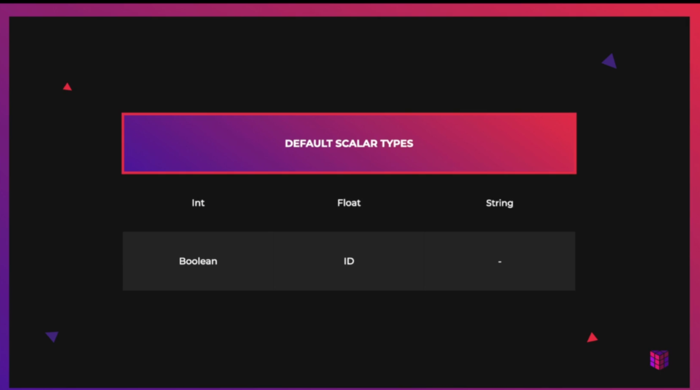

## 学習内容

エンティティ（Entity）: 入出力装置 → データの構造や型を定義し、データのやり取りを管理。

リゾルバー（Resolver）: CPU → クエリやミューテーションを処理し、データを取得・操作。

モジュール（Module）: マザーボード → アプリケーションの構成要素をまとめ、依存関係を管理し、全体として機能させる。

```
# ------------------------------------------------------
# THIS FILE WAS AUTOMATICALLY GENERATED (DO NOT MODIFY)
# ------------------------------------------------------
```

え？schema.gqlって編集したらいけないの？

code first approchの場合



numberはschemaではfloat

もちろんです。提供されたNestJSとGraphQLを使用したリゾルバーの最後の`@Query`デコレーターとその文法について詳しく解説します。また、NestJSにおけるGraphQLリゾルバーの一般的な文法の傾向についても触れます。

### 最後の`@Query`デコレーターの解説

以下が対象となる`@Query`デコレーターとそのメソッドです：

```typescript
@Query(() => Coffee, { name: 'coffee', nullable: true })
async findOne(@Args('id', { type: () => ID }, ParseIntPipe) id: string) {
  return null;
}
```

#### 1. `@Query`デコレーター

- **第一引数** `() => Coffee`:

  - GraphQLスキーマでこのクエリが返す型を指定します。ここでは`Coffee`エンティティの配列ではなく、単一の`Coffee`オブジェクトを返すことを示しています。
  - `() => Coffee`と関数形式で指定する理由は、TypeScriptの型情報がコンパイル時に失われるため、ランタイムで型を確実に取得するためです。

- **第二引数** `{ name: 'coffee', nullable: true }`:
  - `name`: GraphQLスキーマでこのクエリの名前を指定します。デフォルトではメソッド名が使用されますが、ここでは明示的に`coffee`としています。
  - `nullable`: このクエリが`null`を返す可能性があることを示します。つまり、指定したIDに対応する`Coffee`が存在しない場合に`null`を返すことができます。

#### 2. `findOne`メソッド

- **メソッド名**: `findOne`

  - GraphQLスキーマでは`name`オプションで`coffee`と指定されているため、スキーマ上は`findOne`ではなく`coffee`という名前でクエリが定義されます。

- **引数** `@Args('id', { type: () => ID }, ParseIntPipe) id: string`:

  - **`@Args`デコレーター**:
    - `@Args`はGraphQLクエリの引数を受け取るために使用されます。
    - 第一引数 `'id'` はGraphQLクエリで使用される引数の名前を指定します。
    - 第二引数 `{ type: () => ID }` は、この引数がGraphQLの`ID`型であることを指定します。`ID`型は通常文字列ですが、ここではパイプを使用して整数に変換しようとしています。
    - 第三引数 `ParseIntPipe` はNestJSのパイプで、受け取った引数を整数に変換します。これは通常、クエリ引数をバリデートまたは変換するために使用されます。
  - **引数の型** `id: string`:
    - TypeScript側では`id`を`string`型として受け取っていますが、`ParseIntPipe`を適用しているため、実際には整数が期待されます。この点については後述します。

- **戻り値**:
  - 現在は`null`を返していますが、実際の実装では指定された`id`に対応する`Coffee`エンティティを返すことが期待されます。

### 文法上の注意点

1. **`ParseIntPipe`と型の不一致**:

   - `ParseIntPipe`は入力を整数に変換しますが、メソッドの引数`id`は`string`型として定義されています。これにより型の不一致が発生します。
   - 解決策として、`id`の型を`number`に変更するか、`ParseIntPipe`を削除して`id`を文字列のまま扱います。

   ```typescript
   // 型を number に変更
   async findOne(@Args('id', { type: () => ID }, ParseIntPipe) id: number) {
     return null;
   }

   // または ParseIntPipe を削除
   async findOne(@Args('id', { type: () => ID }) id: string) {
     return null;
   }
   ```

2. **GraphQLの`ID`型とTypeScriptの型**:
   - GraphQLの`ID`型は通常文字列として扱われますが、ユニークな識別子として整数やUUIDも使用されることがあります。使用するデータ型に応じて、TypeScript側の型を適切に設定する必要があります。

### NestJSにおけるGraphQLリゾルバーの一般的な文法の傾向

NestJSでGraphQLリゾルバーを作成する際の一般的な文法とパターンについて以下にまとめます。

#### 1. デコレーターの使用

- **`@Resolver`**:

  - GraphQLのリゾルバークラスを定義します。通常、エンティティごとにリゾルバーを作成します。
  - 例: `@Resolver(() => Coffee)`

- **`@Query`**:

  - GraphQLのクエリを定義します。リターンタイプやオプション（名前、nullableなど）を指定します。
  - 例:
    ```typescript
    @Query(() => [Coffee], { name: 'coffees' })
    async findAll() {
      // 実装
    }
    ```

- **`@Mutation`**:

  - GraphQLのミューテーションを定義します。データの作成、更新、削除などを行います。
  - 例:
    ```typescript
    @Mutation(() => Coffee)
    async createCoffee(@Args('createCoffeeInput') input: CreateCoffeeInput) {
      // 実装
    }
    ```

- **`@Args`**:

  - クエリやミューテーションに引数を渡すために使用します。引数名、型、バリデーションパイプなどを指定できます。
  - 例:
    ```typescript
    @Args('id', { type: () => ID }) id: string
    ```

- **`@ResolveProperty`や`@FieldResolver`**:
  - 関連フィールドを解決するために使用します。リレーションシップの解決に役立ちます。
  - 例:
    ```typescript
    @ResolveField(() => User)
    async owner(@Parent() coffee: Coffee) {
      return this.usersService.findOne(coffee.ownerId);
    }
    ```

#### 2. 型の指定

- **リターンタイプの指定**:

  - GraphQLスキーマと一致するように、リターンタイプを明示的に指定します。これにより、型安全性が確保されます。
  - 例: `@Query(() => Coffee)`

- **引数の型指定**:
  - `@Args`デコレーターを使用して、引数の名前と型を指定します。必要に応じてバリデーションパイプを適用します。
  - 例:
    ```typescript
    @Args('id', { type: () => ID }, ParseIntPipe) id: number
    ```

#### 3. パイプとバリデーション

- **パイプの適用**:
  - NestJSのパイプを使用して、引数のバリデーションや変換を行います。例えば、`ParseIntPipe`を使用して文字列を整数に変換します。
  - 例:
    ```typescript
    @Args('id', { type: () => ID }, ParseIntPipe) id: number
    ```

#### 4. 非同期処理のサポート

- **非同期メソッド**:
  - データベースアクセスや他の非同期操作を行う場合、メソッドを`async`として定義し、`Promise`を返します。
  - 例:
    ```typescript
    @Query(() => [Coffee])
    async findAll(): Promise<Coffee[]> {
      return this.coffeesService.findAll();
    }
    ```

#### 5. オプションの設定

- **`nullable`**:

  - フィールドや引数が`null`を許容するかどうかを指定します。これにより、スキーマの柔軟性が向上します。
  - 例:
    ```typescript
    @Query(() => Coffee, { nullable: true })
    async findOne(...) { ... }
    ```

- **`name`**:
  - クエリやミューテーションの名前を明示的に指定します。これにより、メソッド名と異なる名前を使用できます。
  - 例:
    ```typescript
    @Query(() => Coffee, { name: 'coffee' })
    async findOne(...) { ... }
    ```

### まとめ

NestJSを使用してGraphQLリゾルバーを作成する際には、デコレーターを活用してクエリやミューテーションを定義し、型の整合性とバリデーションを確保します。特に、`@Query`デコレーターではリターンタイプやオプションを明示的に指定し、`@Args`デコレーターを使用して引数を適切に定義します。

提供されたコードに関しては、`ParseIntPipe`を使用する場合はTypeScript側の型を`number`に変更するなど、型の整合性を保つことが重要です。これにより、予期しない型エラーを防ぎ、コードの信頼性を高めることができます。

他にも質問があれば、ぜひお知らせください！
